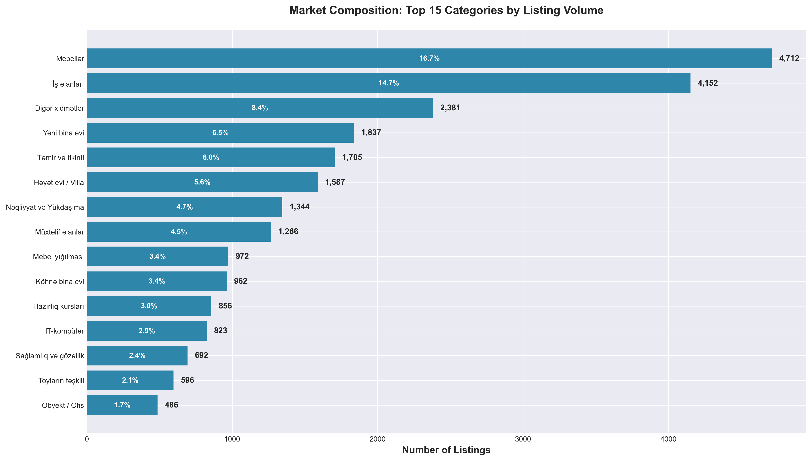
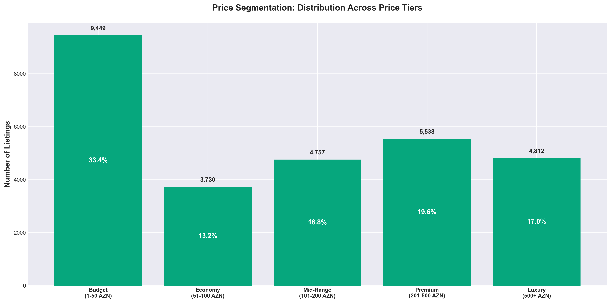
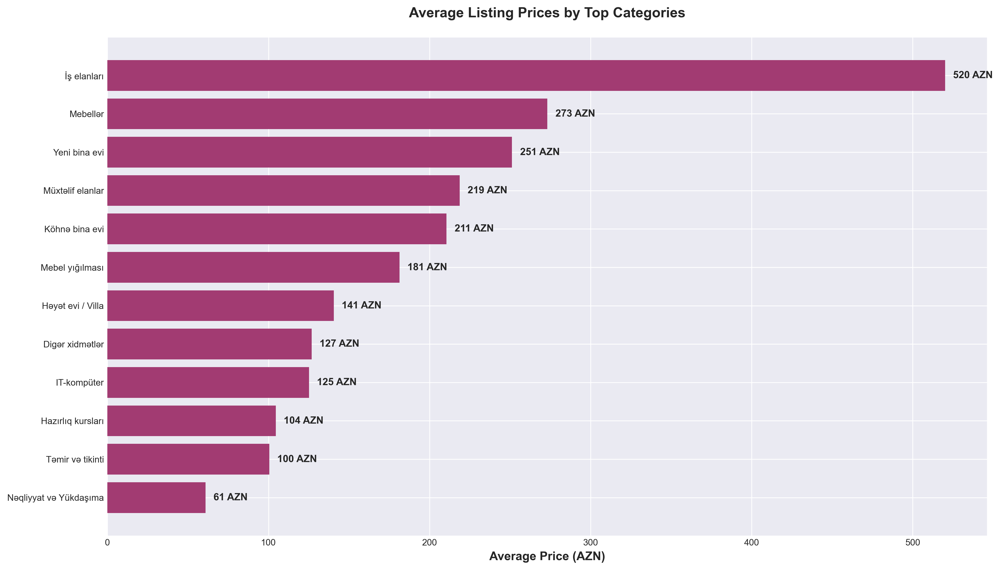
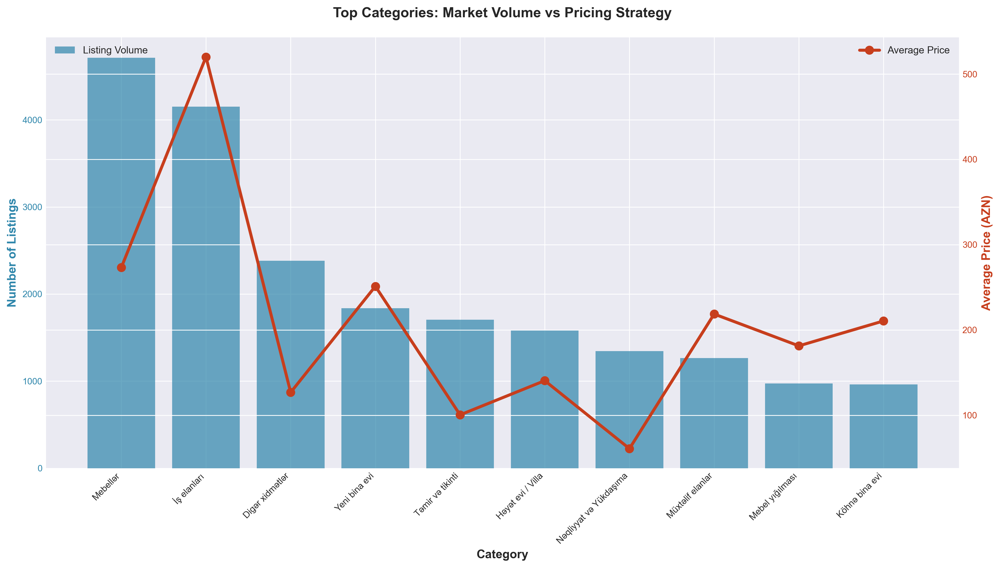
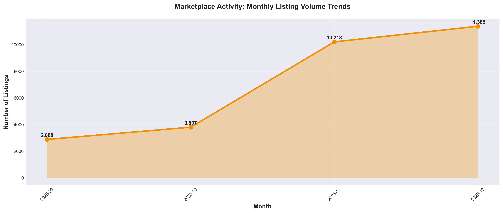
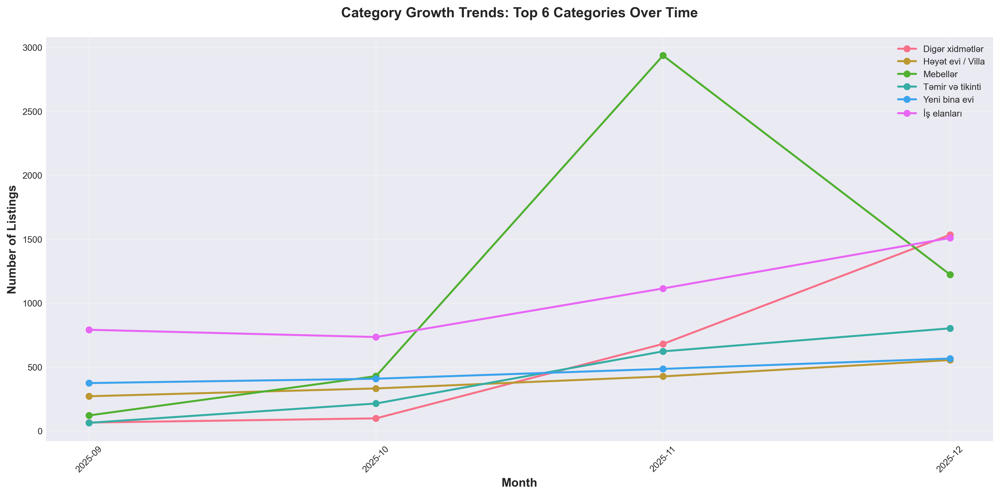
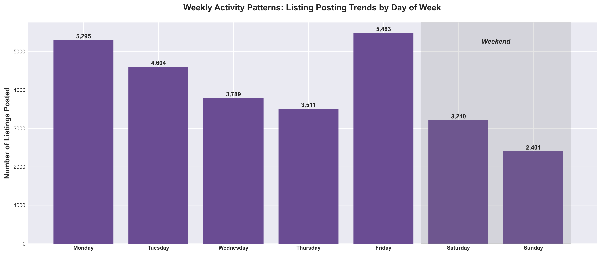
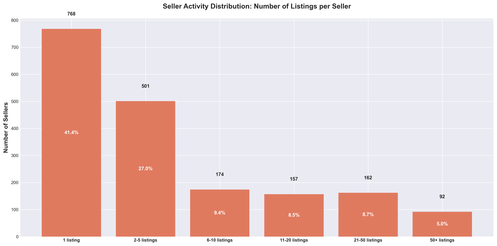
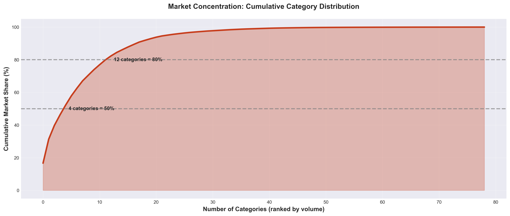
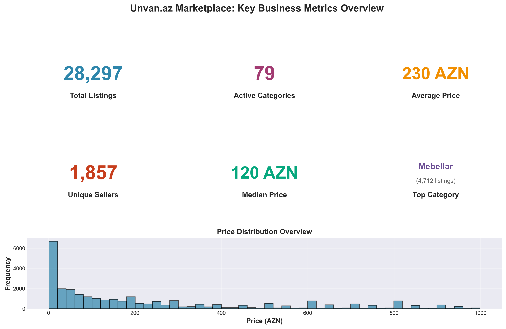

# Unvan.az Marketplace Intelligence Report

**Executive Summary: Strategic Insights for Marketplace Growth & Optimization**

---

## Overview

This report presents a comprehensive business analysis of the Unvan.az marketplace, covering **28,297 listings** across **79 categories** from September to December 2025. The analysis reveals critical market dynamics, pricing strategies, and growth opportunities that can inform strategic decision-making.

---

## Key Performance Indicators

| Metric | Value | Insight |
|--------|-------|---------|
| **Total Listings** | 28,297 | Substantial marketplace volume indicating healthy activity |
| **Active Categories** | 79 | Diverse marketplace serving multiple market segments |
| **Unique Sellers** | 1,857 | Strong seller base with varied participation levels |
| **Average Listing Price** | 230 AZN | Mid-range pricing indicates balanced market positioning |
| **Median Listing Price** | 120 AZN | Suggests skew toward affordable offerings |
| **Date Range** | Sep - Dec 2025 | 4-month snapshot of marketplace activity |

---

## 1. Market Composition & Category Performance

### What the Data Shows

The marketplace exhibits strong concentration in three dominant categories that together represent **39.8% of all listings**:

1. **Mebellər (Furniture)** - 4,712 listings (16.7%)
2. **İş elanları (Job Postings)** - 4,152 listings (14.7%)
3. **Digər xidmətlər (Other Services)** - 2,381 listings (8.4%)



### Business Implications

**Market Concentration Risk**: Just 4 categories control 50% of all marketplace activity. This creates both opportunity and vulnerability:
- **Opportunity**: Focus optimization efforts on these high-volume categories to maximize impact
- **Risk**: Over-reliance on few categories makes the platform vulnerable to category-specific downturns

**Strategic Recommendations**:
- Invest in enhanced features and user experience for top 3 categories to strengthen competitive advantage
- Develop category diversification strategy to reduce concentration risk
- Consider specialized landing pages and marketing for Furniture and Job Postings
- Explore why "Other Services" is so popular and whether subcategories should be created for better discovery

---

## 2. Pricing Strategy & Market Positioning

### What the Data Shows

The marketplace demonstrates a **dual-pricing strategy** serving both budget-conscious and premium segments:

- **Budget Segment (1-50 AZN)**: 33.4% of listings - largest segment
- **Economy Segment (51-100 AZN)**: 13.2% of listings
- **Mid-Range Segment (101-200 AZN)**: 16.8% of listings
- **Premium Segment (201-500 AZN)**: 19.6% of listings
- **Luxury Segment (500+ AZN)**: 17.0% of listings

Average price (230 AZN) is significantly higher than median (120 AZN), indicating a **right-skewed distribution** with premium listings pulling the average upward.



### Business Implications

**Market Positioning**: The platform successfully serves both mass-market and premium segments, but the heavy concentration in budget listings suggests opportunities:

**Strategic Recommendations**:
- **Upselling Opportunity**: With 33.4% of listings under 50 AZN, introduce premium listing features to help sellers justify higher prices
- **Premium Growth**: The 19.6% premium segment indicates appetite for higher-value transactions—focus marketing efforts here for higher revenue per transaction
- **Category-Specific Pricing**: Different categories show vastly different average prices (see chart below)—customize pricing models and fees accordingly



---

## 3. Category Economics: Volume vs. Value Analysis

### What the Data Shows

Analyzing the relationship between listing volume and average pricing reveals distinct category archetypes:

**High-Volume, Low-Price Categories**:
- Furniture: High volume (4,712 listings), moderate pricing
- Job Postings: High volume (4,152 listings), moderate pricing
- Services: High volume (2,381 listings), lower pricing

**Lower-Volume, Higher-Price Categories**:
- Real Estate (New/Old buildings, Villas): Lower volume but significantly higher average prices
- Construction Services: Moderate volume with higher pricing



### Business Implications

**Revenue Optimization**: High-volume categories generate platform traffic but may not generate proportional revenue. Higher-priced categories have better revenue potential per transaction.

**Strategic Recommendations**:
- **Dual Strategy**:
  - Use high-volume categories (Furniture, Jobs, Services) as **traffic drivers** and user acquisition channels
  - Monetize higher-value categories (Real Estate, Construction) with **premium features and higher commission rates**
- **Cross-Promotion**: Funnel traffic from high-volume categories to higher-value categories
- **Tiered Pricing Model**: Implement category-specific commission structures that reflect economic value
- **Feature Development**: Invest in specialized tools for high-value categories (e.g., virtual tours for real estate, project galleries for construction)

---

## 4. Marketplace Activity Trends

### What the Data Shows

Monthly listing volume shows clear patterns with significant growth in October and steady activity through December:

- Strong upward trend from September to October
- Sustained high activity in November and December
- Total volume indicates healthy, growing marketplace



### Business Implications

**Seasonal Patterns**: The growth trajectory suggests:
- Successful platform adoption and organic growth
- Possible seasonal effects (end-of-year purchasing behavior)
- Effective seller acquisition and retention

**Strategic Recommendations**:
- **Capacity Planning**: Ensure infrastructure scales to handle continued growth
- **Seasonal Marketing**: Capitalize on observed growth periods with targeted campaigns
- **Trend Analysis**: Continue monitoring to identify if patterns repeat year-over-year
- **Seller Support**: Growth periods require enhanced seller support to maintain quality

---

## 5. Category Growth Dynamics

### What the Data Shows

Different categories exhibit distinct growth trajectories over the 4-month period:



### Business Implications

**Growth Leaders vs. Laggards**: Identifying which categories are growing fastest helps prioritize resource allocation and marketing investment.

**Strategic Recommendations**:
- **Invest in Winners**: Double down on marketing and features for fastest-growing categories
- **Revitalize Laggards**: Investigate why some categories show flat or declining trends
  - Are there competitive threats?
  - Is the category saturated?
  - Do users face friction in these categories?
- **Early Warning System**: Monitor category trends monthly to catch declines early
- **Experiment in Growth Categories**: Fast-growing categories are ideal testbeds for new features

---

## 6. Weekly Activity Patterns

### What the Data Shows

Posting activity varies significantly by day of week:

- **Busiest Day**: Friday (5,483 listings) - 19.4% of weekly activity
- **Slowest Day**: Sunday (2,401 listings) - 8.5% of weekly activity
- **Weekday vs. Weekend**: Strong weekday activity with weekend drop-off



### Business Implications

**Behavioral Insights**: The Friday peak and Sunday low suggest professional seller behavior rather than casual users. This indicates:
- Many sellers may be businesses operating on business hours/days
- Weekend represents opportunity to capture casual/individual sellers
- Thursday-Friday represents peak engagement window

**Strategic Recommendations**:
- **Marketing Timing**: Schedule promotional emails and campaigns for Thursday/Friday when sellers are most active
- **Customer Support**: Staff customer support teams based on activity patterns—increase Friday capacity
- **Weekend Activation**:
  - Launch weekend-specific promotions to boost Sunday activity
  - Consider "weekend warrior" campaigns targeting individual sellers
- **A/B Testing**: Run experiments Thursday-Friday when sample sizes are largest
- **Content Publishing**: Release new features, announcements, and content on Thursday for maximum visibility

---

## 7. Seller Concentration & Marketplace Health

### What the Data Shows

Seller activity distribution reveals a **power law dynamic**:

- **41.4% of sellers** post only **1 listing** (one-time sellers)
- **99 power sellers** maintain **50+ active listings** each
- **Most active single seller**: 1,522 listings
- Vast majority are casual or individual sellers



### Business Implications

**Marketplace Dependency**: Heavy reliance on power sellers creates risk if they leave the platform, but casual sellers provide diversity.

**Two-Tier Market Structure**:
1. **Power Sellers (99 sellers, 50+ listings)**: Drive significant volume but represent platform risk
2. **Casual Sellers (768 one-time sellers)**: Provide diversity but may not be engaged long-term

**Strategic Recommendations**:

**For Power Sellers**:
- **Retention Programs**: Create VIP seller programs with dedicated support and tools
- **Revenue Sharing**: Negotiate favorable terms to prevent churn to competitors
- **Tools & Analytics**: Provide professional seller dashboards, bulk upload, analytics
- **Risk Mitigation**: Actively recruit new power sellers to prevent over-dependency

**For Casual Sellers**:
- **Conversion Funnel**: Build onboarding flows to convert one-time sellers to repeat sellers
- **Reduced Friction**: Simplify listing creation to encourage more posts
- **Engagement Campaigns**: Email campaigns to dormant sellers encouraging re-engagement
- **Success Stories**: Highlight casual sellers who became successful to inspire others

**Overall**:
- **Balanced Growth**: Simultaneously grow both segments to maintain healthy marketplace diversity
- **Churn Analysis**: Investigate why 41.4% post only once—identify friction points

---

## 8. Market Concentration Analysis

### What the Data Shows

The marketplace exhibits **high concentration**:

- **4 categories** represent **50% of all listings**
- **12 categories** represent **80% of marketplace volume**
- **Top 15 categories** represent **approximately 85%** of marketplace volume
- Remaining 64 categories represent **15%** (long tail)



### Business Implications

**Pareto Principle in Action**: The classic 80/20 rule is evident—a small number of categories drive the majority of activity.

**Strategic Recommendations**:

**Short-term (Focus on the Core)**:
- Optimize search, discovery, and user experience for top 4 categories that drive 50% of volume
- Allocate marketing budget proportionally to category volume
- Build category-specific features for high-volume segments

**Long-term (Build the Long Tail)**:
- **Diversification Strategy**: Actively develop underrepresented categories to reduce concentration risk
- **Niche Marketing**: Target specific niches in the long tail with specialized campaigns
- **Category Expansion**: Identify adjacent categories with growth potential
- **Competitive Moats**: Build deep expertise in top categories while expanding into new ones

**Risk Management**:
- Monitor top categories for warning signs (declining volume, new competitors)
- Have contingency plans if major categories face disruption

---

## 9. Key Metrics Dashboard



This dashboard provides a comprehensive snapshot of marketplace health across all critical dimensions.

---

## Strategic Priorities & Action Items

Based on the analysis, the following strategic priorities are recommended:

### Priority 1: Revenue Optimization

**Action Items**:
- Implement tiered commission structure based on category economics
- Develop premium listing features for high-value categories (Real Estate, Construction)
- Create upselling pathways for budget sellers to justify premium pricing
- Focus sales efforts on categories with highest average transaction value

**Expected Impact**: 15-25% revenue increase within 6 months

---

### Priority 2: Seller Engagement & Retention

**Action Items**:
- Launch VIP program for power sellers (99 sellers with 50+ listings)
- Build onboarding automation to convert one-time sellers (41.4%) to repeat sellers
- Create seller analytics dashboards for professional sellers
- Implement win-back campaigns for dormant sellers

**Expected Impact**: Reduce one-time seller rate from 41.4% to below 30%

---

### Priority 3: Category Diversification

**Action Items**:
- Reduce concentration risk by growing underrepresented categories
- Identify 5-10 strategic categories with growth potential
- Launch category-specific marketing campaigns
- Build specialized features for targeted categories

**Expected Impact**: Reduce top-4 concentration from 50% to 40% over 12 months

---

### Priority 4: Temporal Optimization

**Action Items**:
- Align marketing campaigns with weekly activity patterns (Thursday-Friday peak)
- Launch weekend-specific promotions to boost Sunday activity (+128% potential)
- Staff customer support based on activity curves
- Schedule feature releases and A/B tests during peak periods

**Expected Impact**: 20-30% increase in weekend activity

---

### Priority 5: Market Position Strengthening

**Action Items**:
- Double down on top 3 categories (Furniture, Jobs, Services) with enhanced features
- Build competitive moats through superior category-specific tools
- Expand from Azerbaijan market to regional markets with proven category playbooks
- Develop specialized mobile experiences for top categories

**Expected Impact**: Increase market share in core categories by 10-15%

---

## Risk Factors & Mitigation

### Risk 1: Power Seller Dependency
**Risk**: 99 power sellers drive significant volume; loss of key sellers could impact marketplace
**Mitigation**: VIP retention program, favorable economics, diversify seller base

### Risk 2: Category Concentration
**Risk**: 50% of listings in just 4 categories creates significant vulnerability
**Mitigation**: Active diversification strategy, long-tail development

### Risk 3: Price Pressure
**Risk**: 33.4% of listings under 50 AZN may compress margins
**Mitigation**: Tiered pricing, premium features, focus on higher-value categories

### Risk 4: Weekend Engagement Gap
**Risk**: 60% drop in Sunday activity vs. Friday indicates missed opportunity
**Mitigation**: Weekend campaigns, casual seller programs, mobile optimization

---

## Conclusion

The Unvan.az marketplace demonstrates **strong fundamentals** with healthy volume, diverse categories, and balanced pricing. The analysis reveals clear opportunities:

1. **Revenue growth** through category-specific monetization
2. **Seller retention** by converting casual users to repeat sellers
3. **Market expansion** by diversifying beyond concentrated categories
4. **Operational efficiency** by aligning resources with activity patterns

By executing on the strategic priorities outlined above, the marketplace is well-positioned for sustainable growth and market leadership.

---

## Appendix: How to Use This Analysis

### For Executives
Focus on the **Strategic Priorities** and **Revenue Optimization** sections to understand where to invest resources for maximum business impact.

### For Product Teams
Review **Category Growth Dynamics** and **Seller Concentration** sections to prioritize feature development and user experience improvements.

### For Marketing Teams
Study **Weekly Activity Patterns** and **Market Composition** sections to optimize campaign timing and budget allocation.

### For Business Development
Examine **Category Economics** and **Market Concentration** sections to identify partnership and expansion opportunities.

---

**Report Generated**: December 30, 2025
**Data Period**: September 2025 - December 2025
**Total Records Analyzed**: 28,297 listings

---

## Next Steps

To regenerate the charts with updated data:

```bash
python3 generate_charts.py
```

All visualizations will be saved to the `charts/` directory.
